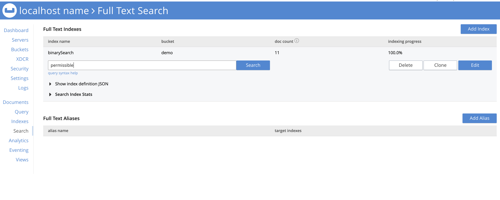
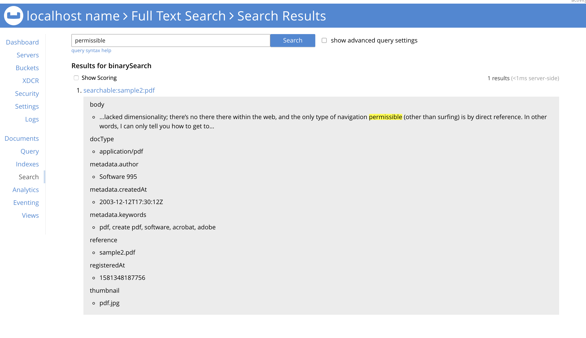

# Couchbase Full Text Search with binary files
Demo project for uploading binary documents into Couchbase and indexing their metadata &amp; content


## Scope
Enabling Couchbase Full Text Search services on binary documents (pdfs, docx, excells, plain text, ...etc). 


## Content

* [Apache Tika](#tika)
* [Couchbase Full Text Search](#couchbase)
* [Getting Started](#gettingstarted)


## <a name="tika"></a>Apache Tika
The **Apache Tika™** toolkit detects and extracts metadata and text from over a thousand different file types (such as PPT, XLS, and PDF). All of these file types can be parsed through a single interface, making Tika useful for search engine indexing, content analysis, translation, and much more. 


### Maven dependencies
If you want to use Tika to parse documents (instead of simply detecting document types, etc.), you'll want to depend on tika-parsers instead:

```
  <dependency>
    <groupId>org.apache.tika</groupId>
    <artifactId>tika-parsers</artifactId>
    <version>1.23</version>
  </dependency>
```

Note that adding this dependency will introduce a number of transitive dependencies to your project, including one on tika-core. You need to make sure that these dependencies won't conflict with your existing project dependencies. You can use the following command in the tika-parsers directory to get a full listing of all the dependencies.

```
$ mvn dependency:tree | grep :compile
```

This demo uses **Tika application** jar that combines several Tika components and all the external parser libraries into a single runnable jar with a GUI and a command line interface.

```
  <dependency>
    <groupId>org.apache.tika</groupId>
    <artifactId>tika-app</artifactId>
    <version>1.23</version>
  </dependency>
```

### Extracting binary files content as Json metadata file

For advanced use cases, we can create custom Parser and Detector classes to have more control over the parsing process.
This section illustrates Apache Tika features using working examples.The illustration methods will be wrapped in a class:

*Class* **DocumentAnalyzer**

```
@Component
public class DocumentAnalyzer {
    private final Logger LOGGER = LoggerFactory.getLogger(DocumentAnalyzer.class);

    private MetadataConverter converter = new MetadataConverter();
    private final Tika analyzer;

    @Autowired
    public DocumentAnalyzer(Tika analyzer) {
        this.analyzer = analyzer;
    }

    public SearchableBinary analyze(FileUpload fileUpload) {
        return analyze(new Metadata(), fileUpload);
    }

    public SearchableBinary analyze(Metadata metadata, FileUpload fileUpload) {
        SearchableBinary doc;
        try {
            String content = analyzer.parseToString(fileUpload.getSearchContentStream(), metadata);

            doc = SearchableBinary.builder()
                    .id(SearchableBinary.PREFIX_TYPE.concat(":").concat(fileUpload.getId()))
                    .docType(extractDocType(metadata))
                    .metadata(converter.from(metadata))
                    .body(content)
                    .thumbnail("pdf.jpg") // TODO extract thumbnail from first page
                    .registeredAt(new Date())
                    .reference(fileUpload.getFilename())
                    .build();

            return doc;
        } catch (TikaException | IOException ex) {
            LOGGER.error("{} analyzing input stream",ex.getClass().getSimpleName(), ex);
            //TODO handle exception
            throw new RuntimeException(ex);
        }
    }

    private String extractDocType(Metadata metadata) {
        String format = metadata.get(TikaCoreProperties.FORMAT);
        return Objects.isNull(format) ? "unknown" : metadata.get(TikaCoreProperties.FORMAT).split(";")[0];

    }

}
```

*Class* **SearchableBinary**:

```
@Data
public class SearchableBinary {
    public static final String PREFIX_TYPE="searchable";

    @Id
    private String id;
    private String body;
    private String reference;
    private String docType;
    private Date registeredAt;
    private String thumbnail;
    private Metadata metadata;

    @Data
    static class Metadata {
        private String createdAt;
        private String lastUpdatedBy;
        private String lastUpdatedAt;
        private String author;
        private final List<String> keywords = new ArrayList<>();
        private final Map<String, String> others = new HashMap<>();
    }
```

*Spring Configuration* **AnalyzerConfig** *Class*:

```
@Configuration
public class AnalyzerConfig {

    @Bean
    public Tika analyzer() {
        //TODO set Tika Config parameters here
        return new Tika();
    }
}
```

Using the Parser and Detector APIs, we can automatically detect the type of a document, as well as extract its content and metadata.


### Supported formats

This section lists all the document formats supported by the parsers in Apache Tika 1.20. Follow the links to the various parser class javadocs for more detailed information about each document format and how it is parsed by Tika.

Please note that Apache Tika is able to detect a much wider range of formats than those listed below, this page only documents those formats from which Tika is able to extract metadata and/or textual content.

* Supported Document Formats
* HyperText Markup Language
* XML and derived formats
* Microsoft Office document formats
* OpenDocument Format
* iWorks document formats
* WordPerfect document formats
* Portable Document Format
* Electronic Publication Format
* Rich Text Format
* Compression and packaging formats
* Text formats
* Feed and Syndication formats
* Help formats
* Audio formats
* Image formats
* Video formats
* Java class files and archives
* Source code
* Mail formats
* CAD formats
* Font formats
* Scientific formats
* Executable programs and libraries
* Crypto formats
* Database formats
* Natural Language Processing
* Image and Video object recognition

[Full list of Supported Formats](https://tika.apache.org/1.23formats.html#Full_list_of_Supported_Formats)


## <a name="couchbase"></a>Couchbase Fulltext Search
Full Text Search provides extensive capabilities for natural-language querying: this allows special search-constraints to be applied to text-queries. Results can be scored, to indicate match-relevancy; and result-sets ordered correspondingly. Conjunctive and disjunctive searches can be performed, whereby common result-subsets from multiple queries can either be returned or omitted.

A full overview of Full Text Search is provided in [Full Text Search: Fundamentals](https://docs.couchbase.com/server/6.0/fts/full-text-intro.html)

### Storing binary files content and metadata as JsonDocument

```
	private void storeInCouchbase(String filename, InputStream inputStream, ByteBuf byteBuf) throws IOException{
		FileDocument doc = analyzer.analyze(inputStream);
		doc.setFilename(filename);
		doc.setDocType(extractDocType(doc.getMetadata()));
		String id = extractId(filename);
		// stores as Json the metdata and content of the binary document
		bucket.upsert(JsonDocument.create(id, toJsonObject(doc)));
	}
```

### Indexing binary files content
Every Full Text Search is performed on a user-created Full Text Index, which contains the targets on which searches are to be performed: these targets are values derived from the textual and other contents of documents within a specified bucket.

Index-creation can be performed by means of the Couchbase Web Console. The basic procedure is outlined in [Searching from the UI](https://docs.couchbase.com/server/6.0/fts/fts-searching-from-the-ui.html). 


**The REST API can be used to create indexes.** Each call requires the following:

* An appropriate username and password.
* Use of the verb **PUT**.
* An endpoint referring to the Full Text Search service, on port **8094**; and including the appropriate endpoint for index-creation as defined by the Full Text Search REST API, including the name of the new index.
* Headers to specify settings for cache-control (no-cache) and application-type (application/json).
* A body containing the JSON document that defines the index to be created. This must include the name of the bucket on which the index is to be created.
[index-binarySearch.json](assets/index-binarySearch.json)

```
{
 "name": "binarySearch",
 "type": "fulltext-index",
 "params": {
  "doc_config": {
   "docid_prefix_delim": "",
   "docid_regexp": "",
   "mode": "type_field",
   "type_field": "type"
  },
...

}
```

The following curl example demonstrates the creation of an index named **binarySearch**, on the **content** field of documents of type **searchable**, within the **demo** bucket. It assumes that Couchbase Server is running on **localhost**, and that the required username and password are **Administrator** and **password**.

```
curl -u Administrator:password -XPUT  \
  http://localhost:8094/api/index/binarySearch \
  -H 'cache-control: no-cache' \
  -H 'content-type: application/json' \
  -d index-binarySearch.json
```

If the call is successful, the following object is returned:

```
{"status":"ok"}
```

The newly created index can then be inspected in the Couchbase Web Console.


### Accessing and Managing Full Text Indexes

Full Text Indexes are different from the Global indexes that are accessed under the Indexes tab in the left-hand navigation panel of the Couchbase Web Console. Full Text Indexes are accessed from the Search tab: left-click on this to display the Full Text Search panel, which contains a tabular presentation of currently existing indexes, with a row for each index. 



And check the results:




### Full Text Search Java SDK library
Couchbase offers Full-text search support, allowing you to search for documents that contain certain words or phrases. In the Java SDK you can search full-text indexes by using the **Bucket.query(SearchQuery)** API.

Querying a FTS index through the Java client is performed through the **Bucket.query(SearchQuery q)** method, providing a SearchQuery. Building a SearchQuery takes two parameters, the index name to query and the actual search query itself (kind of a statement). 

```
   public static final String []SEARCHING_FIELDS = {"registeredAt","reference","metadata", "metadata.author","metadata.createdAt","metadata.keywords","thumbnail"};

    public SearchResult binarySearch(String content) {
        String indexName = "binarySearch";
        QueryStringQuery query = SearchQuery.queryString(content);

        Bucket bucket = searchableBinaryRepository.getCouchbaseOperations().getCouchbaseBucket();
        SearchQueryResult result = bucket.query(new SearchQuery(indexName, query).limit(10).highlight().fields(SEARCHING_FIELDS));

        return SearchResult.from(result);
    }
```

This method returns a **SearchQueryResult** whose iterator yields the results of the query (in the form of **SearchQueryRow** objects). 


### [Optional] Storing binary files in Couchbase

The BinaryDocument can be used to store and read arbitrary bytes. It is the only default codec that directly exposes the underlying low-level Netty ByteBuf objects.

```
	private void storeInCouchbase(String filename, InputStream inputStream, ByteBuf byteBuf) throws IOException{
		...
		String id = extractId(filename);
		bucket.upsert(JsonDocument.create(id, toJsonObject(doc)));
		// Optional uncommented the following line for storing binary files in Couchbase
		bucket.upsert(BinaryDocument.create(id+"_attachment", byteBuf));
	}
```

[Correctly managing binary documents](https://docs.couchbase.com/java-sdk/current/document-operations.html#java-binary-document).

In production, with a large number of documents, read this interesting [blog](https://blog.couchbase.com/large-objects-in-a-database/)


## <a name="gettingstarted"></a>Getting Started

### 1. [Add demo Bucket](https://docs.couchbase.com/server/6.0/manage/manage-buckets/create-bucket.html)


### 2. [Add demo User](https://docs.couchbase.com/server/current/manage/manage-security/manage-users-and-roles.html)


### 3. Add Fulltext Search 'binarySearch' Index

You can create manually the index for content analysis via UI Admin Console: 


Or run the following curl command for adding the index named **binarySearch**, on the **content** field of json documents of type **searchable** (extracted content from binary files), within the **demo** bucket. It assumes that Couchbase Server is running on **localhost**, and that the required username and password are **Administrator** and **password**.

```
curl -u Administrator:password -XPUT  \
  http://localhost:8094/api/index/binarySearch \
  -H 'cache-control: no-cache' \
  -H 'content-type: application/json' \
  -d index-binarySearch.json
```

Index definition json file: [index-binarySearch.json](assets/index-binarySearch.json)

### 4. Starts the application

```
$ mvn spring-boot:run
```


### 5. Upload your binary file (pdf, docs, txt, ..etc)

Open your browser and upload pdfs files using the application UI: [http://localhost:8080](http://localhost:8080)


### 6. Search by content text

[http://localhost:8080/search](http://localhost:8080/search)


## References

* [Apache Tika](https://tika.apache.org/)
* [Apache PdfBox](https://pdfbox.apache.org/)
* [Baeldung - Content Analysis with Apache Tika](https://www.baeldung.com/apache-tika)
* [Full Text Search: Fundamentals](https://docs.couchbase.com/server/6.0/fts/full-text-intro.html)
* [FTS Creating Indexes](https://docs.couchbase.com/server/6.0/fts/fts-creating-indexes.html)
* [Create Bucket](https://docs.couchbase.com/server/6.0/manage/manage-buckets/create-bucket.html)
* [Java SDK - Correctly managing binary documents](https://docs.couchbase.com/java-sdk/current/document-operations.html#java-binary-document)
* [Permanently Store Files in a Database](https://blog.couchbase.com/large-objects-in-a-database/)
* [Add demo User](https://docs.couchbase.com/server/current/manage/manage-security/manage-users-and-roles.html)


